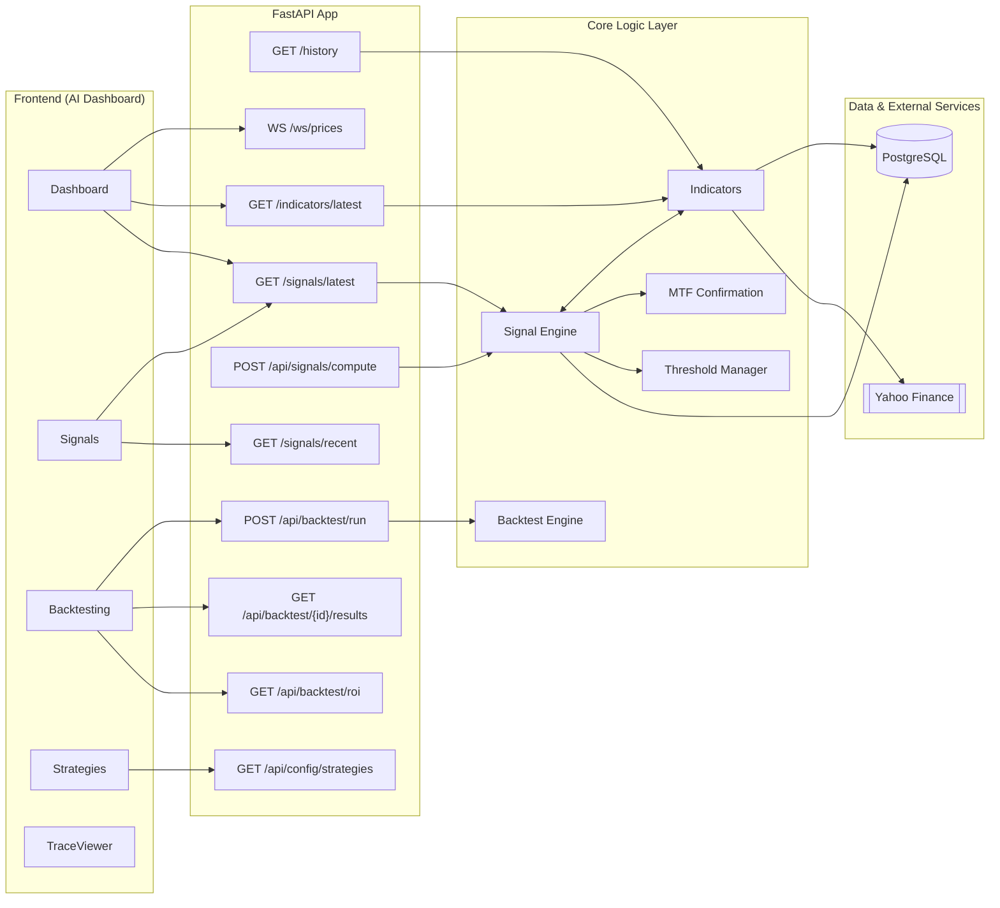
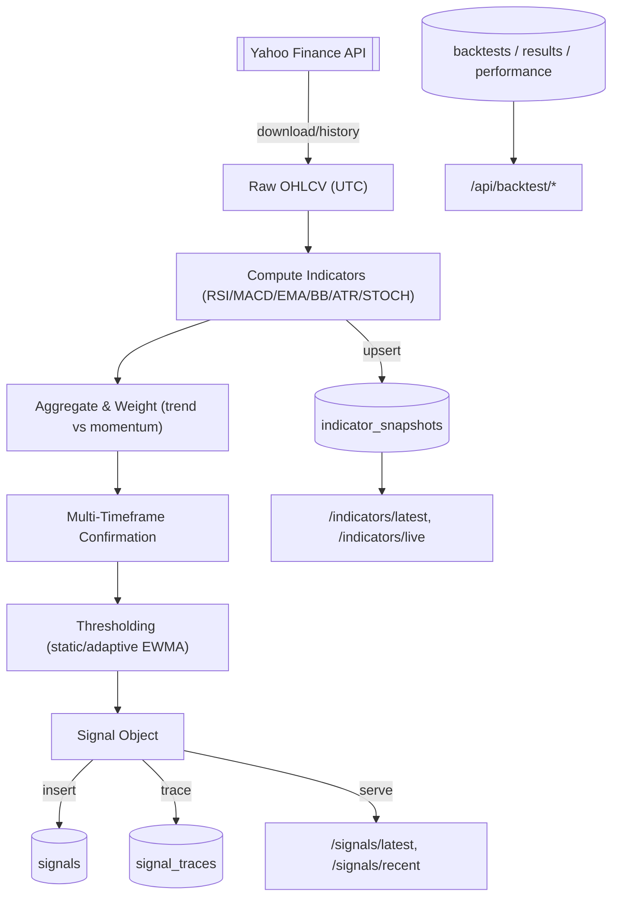

# Vedi-Trade-AI — Deep System Blueprint (Hybrid)

_Last updated: 2025-10-17 18:55 UTC_

This blueprint maps **Endpoints → Logic → Database → yfinance** with multiple Mermaid diagrams, a dense mapping view, table field usage, detected yfinance calls, and environment variables.

---

## 1) Repository Snapshot

- **Root:** `Vedi-Trade-AI-main`
- **Python files:** 62
- **Endpoint count (detected):** 22
- **Tables ensured (detected):** 11

---

## 2) Architecture View (Mermaid)



---

## 3) Data Flow View (Mermaid)



---

## 4) Endpoint ↔ Logic ↔ DB Mapping (Dense)

> Shows up to 22 endpoints for readability.

```mermaid
flowchart LR
  E0["GET /health\nyahoo_server.py::health"]
  E1["GET /history\nyahoo_server.py::history"]
  E2["POST /api/backtest/run\nyahoo_server.py::run_backtest"]
  E3["GET /api/backtest/roi\nyahoo_server.py::calculate_roi"]
  E4["GET /api/backtest/{backtest_id}/results\nyahoo_server.py::get_backtest_results"]
  E5["GET /api/backtest/list\nyahoo_server.py::list_backtests"]
  E6["WEBSOCKET /ws/prices\nyahoo_server.py::ws_prices"]
  E7["GET /signals/recent\nyahoo_server.py::recent_signals"]
  E8["GET /signals/latest\nyahoo_server.py::latest_signal"]
  E9["GET /indicators/latest\nyahoo_server.py::indicators_latest"]
  E10["POST /api/signals/compute\nyahoo_server.py::signals_compute"]
  E11["GET /indicators/live\nyahoo_server.py::indicators_live"]
  E12["GET /api/trace/{signal_id}\nyahoo_server.py::get_trace"]
  E13["GET /api/indicators/contributions/{signal_id}\nyahoo_server.py::get_indicator_contributions"]
  E14["GET /api/config/strategies\nyahoo_server.py::get_all_strategies"]
  E15["GET /api/config/strategies/{strategy_id}\nyahoo_server.py::get_strategy_by_id"]
  E16["PATCH /api/config/strategies/{strategy_id}/indicator/{indicator_name}\nyahoo_server.py::update_strategy_indicator"]
  E17["PATCH /api/config/strategies/{strategy_id}/weights\nyahoo_server.py::update_strategy_weights"]
  E18["PATCH /api/config/strategies/{strategy_id}/schedule\nyahoo_server.py::update_strategy_schedule"]
  E19["PATCH /api/config/strategies/{strategy_id}/threshold\nyahoo_server.py::update_strategy_threshold"]
  E20["POST /api/config/strategies/{strategy_id}/activate\nyahoo_server.py::activate_strategy"]
  E21["GET /health\nyahoo_server.py::health_check"]
  subgraph Logic["Logic Modules"]
    L_signal_engine_0["signal_engine.py"]
    L_indicators_0["indicator_stats.py"]
    L_indicators_1["indicators.py"]
    L_indicators_2["test_indicator_stats.py"]
    L_mtf_confirmation_0["mtf_confirmation.py"]
    L_threshold_manager_0["auto_threshold.py"]
    L_threshold_manager_1["threshold_manager.py"]
    L_threshold_manager_2["test_enhanced_threshold_manager.py"]
    L_threshold_manager_3["test_auto_threshold.py"]
    L_backtest_engine_0["backtest_engine.py"]
    L_backtest_engine_1["test_backtest_engine.py"]
    L_backtest_engine_2["test_backtest_timing.py"]
    L_db_0["db.py"]
    L_yahoo_fetcher_0["yahoo_fetcher.py"]
    L_yahoo_fetcher_1["yahoo_server.py"]
    L_server_files_0["yahoo_server.py"]
  end
  T_backtest_signals["backtest_signals"]
  T_backtests["backtests"]
  T_indicator_snapshots["indicator_snapshots"]
  T_signal_performance_daily["signal_performance_daily"]
  T_signal_performance_summary["signal_performance_summary"]
  T_signal_results["signal_results"]
  T_signal_traces["signal_traces"]
  T_signals["signals"]
  T_strategies["strategies"]
  T_strategy_indicators["strategy_indicators"]
  T_strategy_weights["strategy_weights"]
  YFAPI[["yfinance"]]
  E0 --> L_signal_engine_0
  E0 --> L_indicators_1
  E0 --> L_mtf_confirmation_0
  E0 --> L_threshold_manager_1
  E0 --> L_db_0
  E0 --> L_yahoo_fetcher_1
  E0 --> L_server_files_0
  E1 --> L_signal_engine_0
  E1 --> L_indicators_1
  E1 --> L_mtf_confirmation_0
  E1 --> L_threshold_manager_1
  E1 --> L_db_0
  E1 --> L_yahoo_fetcher_1
  E1 --> L_server_files_0
  E2 --> L_signal_engine_0
  E2 --> L_indicators_1
  E2 --> L_mtf_confirmation_0
  E2 --> L_threshold_manager_1
  E2 --> L_db_0
  E2 --> L_yahoo_fetcher_1
  E2 --> L_server_files_0
  E3 --> L_signal_engine_0
  E3 --> L_indicators_1
  E3 --> L_mtf_confirmation_0
  E3 --> L_threshold_manager_1
  E3 --> L_db_0
  E3 --> L_yahoo_fetcher_1
  E3 --> L_server_files_0
  E4 --> L_signal_engine_0
  E4 --> L_indicators_1
  E4 --> L_mtf_confirmation_0
  E4 --> L_threshold_manager_1
  E4 --> L_db_0
  E4 --> L_yahoo_fetcher_1
  E4 --> L_server_files_0
  E5 --> L_signal_engine_0
  E5 --> L_indicators_1
  E5 --> L_mtf_confirmation_0
  E5 --> L_threshold_manager_1
  E5 --> L_db_0
  E5 --> L_yahoo_fetcher_1
  E5 --> L_server_files_0
  E6 --> L_signal_engine_0
  E6 --> L_indicators_1
  E6 --> L_mtf_confirmation_0
  E6 --> L_threshold_manager_1
  E6 --> L_db_0
  E6 --> L_yahoo_fetcher_1
  E6 --> L_server_files_0
  E7 --> L_signal_engine_0
  E7 --> L_indicators_1
  E7 --> L_mtf_confirmation_0
  E7 --> L_threshold_manager_1
  E7 --> L_db_0
  E7 --> L_yahoo_fetcher_1
  E7 --> L_server_files_0
  E8 --> L_signal_engine_0
  E8 --> L_indicators_1
  E8 --> L_mtf_confirmation_0
  E8 --> L_threshold_manager_1
  E8 --> L_db_0
  E8 --> L_yahoo_fetcher_1
  E8 --> L_server_files_0
  E9 --> L_signal_engine_0
  E9 --> L_indicators_1
  E9 --> L_mtf_confirmation_0
  E9 --> L_threshold_manager_1
  E9 --> L_db_0
  E9 --> L_yahoo_fetcher_1
  E9 --> L_server_files_0
  E10 --> L_signal_engine_0
  E10 --> L_indicators_1
  E10 --> L_mtf_confirmation_0
  E10 --> L_threshold_manager_1
  E10 --> L_db_0
  E10 --> L_yahoo_fetcher_1
  E10 --> L_server_files_0
  E11 --> L_signal_engine_0
  E11 --> L_indicators_1
  E11 --> L_mtf_confirmation_0
  E11 --> L_threshold_manager_1
  E11 --> L_db_0
  E11 --> L_yahoo_fetcher_1
  E11 --> L_server_files_0
  E12 --> L_signal_engine_0
  E12 --> L_indicators_1
  E12 --> L_mtf_confirmation_0
  E12 --> L_threshold_manager_1
  E12 --> L_db_0
  E12 --> L_yahoo_fetcher_1
  E12 --> L_server_files_0
  E13 --> L_signal_engine_0
  E13 --> L_indicators_1
  E13 --> L_mtf_confirmation_0
  E13 --> L_threshold_manager_1
  E13 --> L_db_0
  E13 --> L_yahoo_fetcher_1
  E13 --> L_server_files_0
  E14 --> L_signal_engine_0
  E14 --> L_indicators_1
  E14 --> L_mtf_confirmation_0
  E14 --> L_threshold_manager_1
  E14 --> L_db_0
  E14 --> L_yahoo_fetcher_1
  E14 --> L_server_files_0
  E15 --> L_signal_engine_0
  E15 --> L_indicators_1
  E15 --> L_mtf_confirmation_0
  E15 --> L_threshold_manager_1
  E15 --> L_db_0
  E15 --> L_yahoo_fetcher_1
  E15 --> L_server_files_0
  E16 --> L_signal_engine_0
  E16 --> L_indicators_1
  E16 --> L_mtf_confirmation_0
  E16 --> L_threshold_manager_1
  E16 --> L_db_0
  E16 --> L_yahoo_fetcher_1
  E16 --> L_server_files_0
  E17 --> L_signal_engine_0
  E17 --> L_indicators_1
  E17 --> L_mtf_confirmation_0
  E17 --> L_threshold_manager_1
  E17 --> L_db_0
  E17 --> L_yahoo_fetcher_1
  E17 --> L_server_files_0
  E18 --> L_signal_engine_0
  E18 --> L_indicators_1
  E18 --> L_mtf_confirmation_0
  E18 --> L_threshold_manager_1
  E18 --> L_db_0
  E18 --> L_yahoo_fetcher_1
  E18 --> L_server_files_0
  E19 --> L_signal_engine_0
  E19 --> L_indicators_1
  E19 --> L_mtf_confirmation_0
  E19 --> L_threshold_manager_1
  E19 --> L_db_0
  E19 --> L_yahoo_fetcher_1
  E19 --> L_server_files_0
  E20 --> L_signal_engine_0
  E20 --> L_indicators_1
  E20 --> L_mtf_confirmation_0
  E20 --> L_threshold_manager_1
  E20 --> L_db_0
  E20 --> L_yahoo_fetcher_1
  E20 --> L_server_files_0
  E21 --> L_signal_engine_0
  E21 --> L_indicators_1
  E21 --> L_mtf_confirmation_0
  E21 --> L_threshold_manager_1
  E21 --> L_db_0
  E21 --> L_yahoo_fetcher_1
  E21 --> L_server_files_0
  L_db_0 --> T_signals
  L_db_0 --> T_indicator_snapshots
  L_db_0 --> T_strategies
  L_db_0 --> T_strategy_indicators
  L_db_0 --> T_strategy_weights
  L_db_0 --> T_backtests
  L_backtest_engine_0 --> T_backtests
  L_db_0 --> T_backtest_signals
  L_backtest_engine_0 --> T_backtest_signals
  L_db_0 --> T_signal_performance_summary
  YFAPI --> L_yahoo_fetcher_1
  YFAPI --> L_server_files_0
```



---

## 5) Tables and Field Usage in Logic

### Table `backtest_signals`
- **Read in:** db.py
- **Written in:** backtest_engine.py, db.py
- **Columns referenced (detected):** —

### Table `backtests`
- **Read in:** db.py
- **Written in:** backtest_engine.py, db.py
- **Columns referenced (detected):** COUNTCASEWHENbs.resultlossTHEN1END, COUNTCASEWHENbs.resultopenTHEN1END, COUNTCASEWHENbs.resultprofitTHEN1END, COUNTbs.id, b.*

### Table `indicator_snapshots`
- **Read in:** db.py
- **Written in:** db.py
- **Columns referenced (detected):** evaluation, indicators, strategy, symbol, timeframe, timestamp

### Table `signal_performance_daily`
- **Read in:** —
- **Written in:** signal_performance_evaluator.py
- **Columns referenced (detected):** —

### Table `signal_performance_summary`
- **Read in:** db.py
- **Written in:** signal_performance_evaluator.py
- **Columns referenced (detected):** —

### Table `signal_results`
- **Read in:** —
- **Written in:** signal_performance_evaluator.py
- **Columns referenced (detected):** —

### Table `signal_traces`
- **Read in:** db_trace.py
- **Written in:** db_trace.py
- **Columns referenced (detected):** data, event, id, signal_id, symbol, timeframe, ts_utc

### Table `signals`
- **Read in:** db.py, signal_performance_evaluator.py
- **Written in:** db.py
- **Columns referenced (detected):** AVGCASEWHENsr.resultINprofit, COUNT*, COUNTCASEWHENsr.resultlossTHEN1END, COUNTCASEWHENsr.resultopenTHEN1END, COUNTCASEWHENsr.resultprofitTHEN1END, SUMCASEWHENsr.resultINprofit, indicator_contributions, lossTHENsr.profit_pctELSE0END, lossTHENsr.profit_pctEND, s.*, sr.evaluated_at, sr.result

### Table `strategies`
- **Read in:** db.py
- **Written in:** db.py
- **Columns referenced (detected):** confirmation_timeframe, created_at, description, id, is_active, name, primary_timeframe, run_interval_seconds, signal_threshold, trend_timeframe, updated_at

### Table `strategy_indicators`
- **Read in:** db.py
- **Written in:** db.py
- **Columns referenced (detected):** indicator_name, params

### Table `strategy_weights`
- **Read in:** db.py
- **Written in:** db.py
- **Columns referenced (detected):** weights


---

## 6) yfinance Integration

**Detected yfinance method calls:**
- `Ticker` in `yahoo_server.py`
- `Ticker` in `yahoo_server.py`
- `Ticker` in `yahoo_server.py`
- `Ticker` in `yahoo_server.py`
- `history` in `yahoo_server.py`
- `history` in `yahoo_server.py`
- `history` in `yahoo_server.py`
- `history` in `yahoo_server.py`
- `history` in `yahoo_server.py`
- `Ticker` in `test_fastinfo_complete.py`

---

## 7) Environment Variables

```dotenv
DB_HOST=localhost
DB_PORT=5432
DB_NAME=vedi_trading
DB_USER=vedi_user
DB_PASSWORD=change_me_strong
PORT=8000
CORS_ALLOW_ORIGINS=http://localhost:3000
VEDI_LOG_LEVEL=info
```

---

## 8) Full Endpoint Inventory (Detected)

```json
[
  {
    "file": "Vedi-Trade-AI-main/app/yahoo_server.py",
    "method": "GET",
    "path": "/health",
    "function": "health"
  },
  {
    "file": "Vedi-Trade-AI-main/app/yahoo_server.py",
    "method": "GET",
    "path": "/history",
    "function": "history"
  },
  {
    "file": "Vedi-Trade-AI-main/app/yahoo_server.py",
    "method": "POST",
    "path": "/api/backtest/run",
    "function": "run_backtest"
  },
  {
    "file": "Vedi-Trade-AI-main/app/yahoo_server.py",
    "method": "GET",
    "path": "/api/backtest/roi",
    "function": "calculate_roi"
  },
  {
    "file": "Vedi-Trade-AI-main/app/yahoo_server.py",
    "method": "GET",
    "path": "/api/backtest/{backtest_id}/results",
    "function": "get_backtest_results"
  },
  {
    "file": "Vedi-Trade-AI-main/app/yahoo_server.py",
    "method": "GET",
    "path": "/api/backtest/list",
    "function": "list_backtests"
  },
  {
    "file": "Vedi-Trade-AI-main/app/yahoo_server.py",
    "method": "WEBSOCKET",
    "path": "/ws/prices",
    "function": "ws_prices"
  },
  {
    "file": "Vedi-Trade-AI-main/app/yahoo_server.py",
    "method": "GET",
    "path": "/signals/recent",
    "function": "recent_signals"
  },
  {
    "file": "Vedi-Trade-AI-main/app/yahoo_server.py",
    "method": "GET",
    "path": "/signals/latest",
    "function": "latest_signal"
  },
  {
    "file": "Vedi-Trade-AI-main/app/yahoo_server.py",
    "method": "GET",
    "path": "/indicators/latest",
    "function": "indicators_latest"
  },
  {
    "file": "Vedi-Trade-AI-main/app/yahoo_server.py",
    "method": "POST",
    "path": "/api/signals/compute",
    "function": "signals_compute"
  },
  {
    "file": "Vedi-Trade-AI-main/app/yahoo_server.py",
    "method": "GET",
    "path": "/indicators/live",
    "function": "indicators_live"
  },
  {
    "file": "Vedi-Trade-AI-main/app/yahoo_server.py",
    "method": "GET",
    "path": "/api/trace/{signal_id}",
    "function": "get_trace"
  },
  {
    "file": "Vedi-Trade-AI-main/app/yahoo_server.py",
    "method": "GET",
    "path": "/api/indicators/contributions/{signal_id}",
    "function": "get_indicator_contributions"
  },
  {
    "file": "Vedi-Trade-AI-main/app/yahoo_server.py",
    "method": "GET",
    "path": "/api/config/strategies",
    "function": "get_all_strategies"
  },
  {
    "file": "Vedi-Trade-AI-main/app/yahoo_server.py",
    "method": "GET",
    "path": "/api/config/strategies/{strategy_id}",
    "function": "get_strategy_by_id"
  },
  {
    "file": "Vedi-Trade-AI-main/app/yahoo_server.py",
    "method": "PATCH",
    "path": "/api/config/strategies/{strategy_id}/indicator/{indicator_name}",
    "function": "update_strategy_indicator"
  },
  {
    "file": "Vedi-Trade-AI-main/app/yahoo_server.py",
    "method": "PATCH",
    "path": "/api/config/strategies/{strategy_id}/weights",
    "function": "update_strategy_weights"
  },
  {
    "file": "Vedi-Trade-AI-main/app/yahoo_server.py",
    "method": "PATCH",
    "path": "/api/config/strategies/{strategy_id}/schedule",
    "function": "update_strategy_schedule"
  },
  {
    "file": "Vedi-Trade-AI-main/app/yahoo_server.py",
    "method": "PATCH",
    "path": "/api/config/strategies/{strategy_id}/threshold",
    "function": "update_strategy_threshold"
  },
  {
    "file": "Vedi-Trade-AI-main/app/yahoo_server.py",
    "method": "POST",
    "path": "/api/config/strategies/{strategy_id}/activate",
    "function": "activate_strategy"
  },
  {
    "file": "Vedi-Trade-AI-main/app/yahoo_server.py",
    "method": "GET",
    "path": "/health",
    "function": "health_check"
  }
]
```
